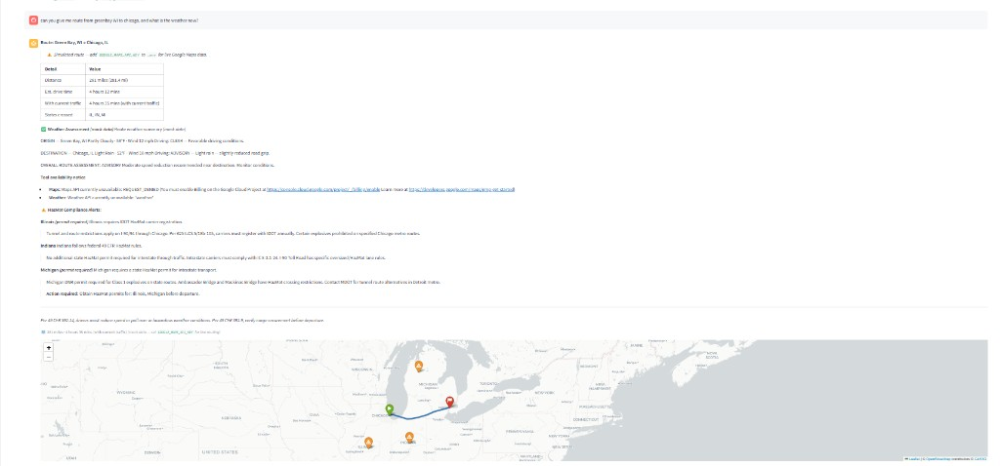
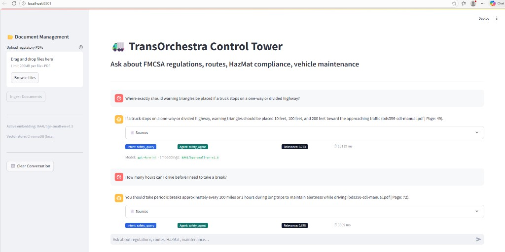
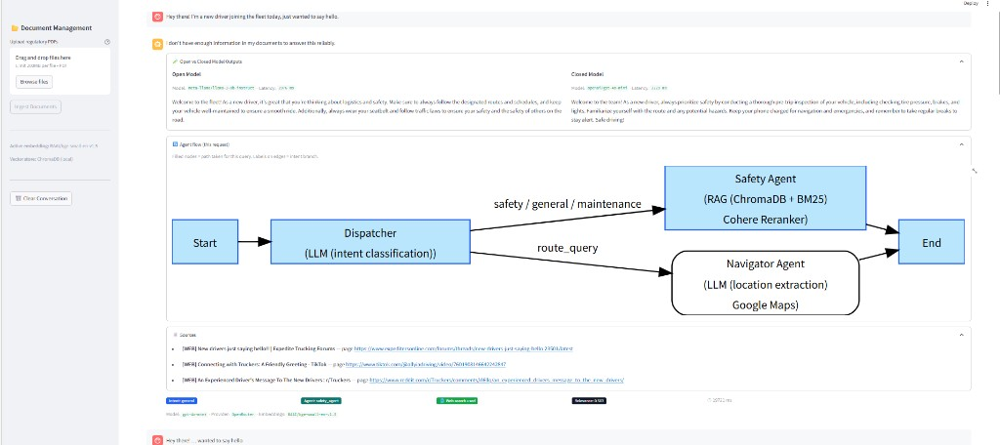

# 🚛 TransOrchestra — Multi-Agent Logistics Control Plane

> **Capstone Project — Analytics Vidya GenAI Pinnacle Program**  
> A production-grade RAG + Multi-Agent AI system for the transportation and logistics industry.

---

## Problem Statement

The commercial trucking and logistics industry operates under one of the most complex regulatory environments in the United States. Fleet dispatchers, safety officers, and drivers must make high-stakes decisions in real-time — often without immediate access to the correct page of the correct regulation. The cost of a wrong decision is measured not in SLAs, but in accidents, fatalities, and seven-figure fines.

The **Knowledge-to-Action gap** in logistics is acute: regulatory knowledge lives in PDFs and manuals that no dispatcher has time to fully read, while the questions that arise at 2am at a weigh station demand precise, sourced, actionable answers in seconds. Generic search engines surface noisy results; hallucination-prone LLMs confidently fabricate regulation codes that do not exist.

**TransOrchestra** addresses this gap with a production-grade RAG + Multi-Agent architecture. Regulatory documents are indexed into a hybrid vector/keyword retrieval system; a LangGraph dispatcher routes each query to the right specialist agent; and a corrective web-search fallback triggers automatically when the indexed corpus lacks sufficient coverage. Every answer includes a source citation (filename + page number), making the system auditable and trustworthy in a compliance context.

---

## System Architecture

```
┌─────────────────────────────────────────┐
│         User (Browser)                  │
└──────────────┬──────────────────────────┘
               │
               ▼
┌─────────────────────────────────────────┐
│    Streamlit Frontend  (port 8501)      │
│  • Chat interface with source citations │
│  • PDF upload + ingest sidebar          │
│  • Intent badge + latency display       │
└──────────────┬──────────────────────────┘
               │  POST /api/v1/query
               ▼
┌─────────────────────────────────────────┐
│    FastAPI Backend  (port 8000)         │
│  • /api/v1/query  — main query endpoint │
│  • /api/v1/ingest — document ingestion  │
│  • /api/v1/health — liveness check      │
└──────────────┬──────────────────────────┘
               │
               ▼
┌─────────────────────────────────────────┐
│    LangGraph Orchestrator               │
│                                         │
│  ┌──────────────────────────────┐       │
│  │  Dispatcher Node             │       │
│  │  • Classifies intent via LLM │       │
│  │  • safety / route / maint /  │       │
│  │    general                   │       │
│  └──────┬──────────────┬────────┘       │
│         │              │                │
│         ▼              ▼                │
│  ┌─────────────┐ ┌──────────────┐       │
│  │ Safety Agent│ │ Navigator    │       │
│  │             │ │ Agent        │       │
│  │ • BM25      │ │ • Google     │       │
│  │ • Vector    │ │   Maps route │       │
│  │ • Hybrid    │ │ • MCP Weather│       │
│  │ • Reranker  │ │   Server     │       │
│  │ • Tavily    │ │ • HazMat     │       │
│  │   fallback  │ │   compliance │       │
│  └─────────────┘ └──────────────┘       │
│  └─────────────┘                        │
│                                         │
│  MemorySaver — thread-level persistence │
└──────────────┬──────────────────────────┘
               │
               ▼
    Response with:
    • Answer text
    • Source citations (filename + page)
    • Intent classification
    • Web search flag
    • Latency (ms)
    • route_data  (map polyline + compliance — route queries only)
    • weather_data (safety level + forecast — route queries only)
    • agent_used (safety_agent | navigator_agent)
    • relevance_score (safety_agent only)
    • llm_model / embedding_model (telemetry for UI)
```

---

## Tech Stack

| Component | Technology | Version |
|-----------|-----------|---------|
| Frontend | Streamlit | 1.37.1 |
| Backend API | FastAPI + Uvicorn | 0.111.0 / 0.30.1 |
| Agent Orchestration | LangGraph | 0.2.14 |
| LLM | OpenAI GPT-4o-mini | via openai 1.40.6 |
| Embeddings (primary) | BAAI/bge-small-en-v1.5 | sentence-transformers 3.0.1 |
| Embeddings (comparison) | OpenAI text-embedding-3-small | langchain-openai 0.1.23 |
| Vector Store | ChromaDB (local, persisted) | 0.5.18 |
| Keyword Retrieval | BM25 | rank-bm25 0.2.2 |
| Hybrid Retrieval | EnsembleRetriever (BM25 0.4 + Vector 0.6) | langchain 0.2.16 |
| Reranker | Cohere rerank-english-v3.0 | langchain-cohere 0.2.4 |
| Web Search Fallback | Tavily API | tavily-python 0.3.9 |
| Route Maps | Google Maps API + Folium | googlemaps 4.10.0 / folium 0.17.0 |
| Map rendering (Streamlit) | streamlit-folium | 0.22.0 |
| Weather Data | OpenWeatherMap REST API | httpx 0.27.0 |
| MCP Server | Model Context Protocol | mcp 1.0.0 |
| RAG Framework | LangChain | 0.2.16 |
| Observability & Tracing | LangSmith | ≥ 0.1.112 |
| Evaluation | Ragas (Faithfulness + Answer Relevancy) | 0.1.21 |
| Document Loading | PyPDF | 4.3.1 |
| Text Splitting | langchain-text-splitters | 0.2.4 |
| Config Management | Pydantic Settings (`BaseSettings`) | pydantic-settings 2.4.0 |

---

## Capstone Requirements Checklist

| Requirement | Status | Implementation |
|---|---|---|
| Load & index documents into vector DB | ✅ | `scripts/ingest.py` + ChromaDB |
| Experiment with 2 embedding models | ✅ | BGE small (default) vs OpenAI text-embedding-3-small |
| Multiple retrieval strategies | ✅ | Vector, BM25, Hybrid (EnsembleRetriever), Reranker |
| RAG pipeline with source attribution | ✅ | filename + page number on every answer |
| Multi-agent conversational RAG with memory | ✅ | LangGraph + MemorySaver (thread-level) |
| Streamlit app with PDF upload + chat | ✅ | `frontend/app.py` |
| Corrective RAG with web search fallback | ✅ | Tavily triggered when relevance score < threshold |
| Ragas evaluation | ✅ | `eval/run_ragas.py` — Faithfulness + Answer Relevancy |
| Observability & production tracing | ✅ | LangSmith — full trace of every LLM call, retriever, and agent hop |
| Live route maps with compliance overlays | ✅ | Google Maps API + Folium + per-state HazMat compliance alerts |
| MCP weather server + driving safety card | ✅ | OpenWeatherMap via MCP protocol — CLEAR / ADVISORY / CAUTION / DANGEROUS |

---

## Quick Start

### Prerequisites

- Python 3.11 or 3.12
- Microsoft C++ Build Tools (Windows only — required for ChromaDB)
- OpenAI API key (required)
- Cohere API key (optional — free tier, enables reranking)
- Tavily API key (optional — free tier, enables web search fallback)

### Step 1 — Clone / navigate to the project

```powershell
cd "C:\path\to\transOrchestra"
```

### Step 2 — Create virtual environment

```powershell
python -m venv venv
venv\Scripts\Activate.ps1        # Windows PowerShell
# source venv/bin/activate       # macOS / Linux
```

### Step 3 — Install dependencies

```powershell
pip install -r requirements.txt
```

> **Windows note:** If you see `chroma-hnswlib` build errors, install C++ Build Tools first:
> ```powershell
> winget install Microsoft.VisualStudio.2022.BuildTools --override "--quiet --wait --add Microsoft.VisualStudio.Workload.VCTools --includeRecommended"
> ```
> Then reopen PowerShell and retry.

### Step 4 — Configure environment variables

```powershell
copy .env.example .env
# Open .env and fill in your API keys
```

> **Note (common setup):** This project can load `.env` from either:
> - `transOrchestra/.env` (recommended)
> - `Final_Project/.env` (supported for your workspace layout)

```env
OPENAI_API_KEY=sk-...            # Required
COHERE_API_KEY=...               # Optional (free at dashboard.cohere.com)
TAVILY_API_KEY=tvly-...          # Optional (free at app.tavily.com)
GOOGLE_MAPS_API_KEY=AIza...      # Optional (enables live routing — mock map works without it)
OPENWEATHERMAP_API_KEY=...       # Optional (free 1M calls/month at openweathermap.org/api)
WEATHER_UNITS=imperial           # imperial = °F / mph  |  metric = °C / kph
CHROMA_PERSIST_DIR=./chroma_db
EMBEDDING_MODEL=BAAI/bge-small-en-v1.5
LLM_MODEL=gpt-4o-mini
CHUNK_SIZE=512
CHUNK_OVERLAP=50
TOP_K_RETRIEVAL=10
TOP_K_RERANK=3
RELEVANCE_SCORE_THRESHOLD=0.6

# LangSmith tracing (optional — set to true to enable)
LANGCHAIN_TRACING_V2=false
LANGCHAIN_API_KEY=lsv2_pt_...    # Free at smith.langchain.com
LANGCHAIN_PROJECT=transOrchestra
LANGCHAIN_ENDPOINT=https://api.smith.langchain.com
```

### Step 5 — Add regulatory PDF documents

Place FMCSA/DOT regulatory PDFs into the `data/` directory.

**Recommended free downloads from [fmcsa.dot.gov](https://www.fmcsa.dot.gov):**
- 49 CFR Parts 350–399 (Federal Motor Carrier Safety Regulations)
- 49 CFR Parts 100–185 (Hazardous Materials)
- Hours of Service of Drivers guide
- Commercial Driver's License Standards

Then ingest:

```powershell
python scripts/ingest.py --pdf_dir ./data
```

### Step 6 — Start the FastAPI backend (Terminal 1)

```powershell
uvicorn backend.main:app --reload
```

Expected output:
```
INFO: TransOrchestra API starting...
INFO: Embedding model: BAAI/bge-small-en-v1.5
INFO: LLM model: gpt-4o-mini
INFO: LangSmith tracing: ENABLED → project 'transOrchestra'
INFO: Uvicorn running on http://127.0.0.1:8000
```

### Step 7 — Start the Streamlit frontend (Terminal 2)

```powershell
streamlit run frontend/app.py
```

Browser opens automatically at **http://localhost:8501**

---

## API Reference

Base URL: `http://localhost:8000/api/v1`  
Interactive docs: `http://localhost:8000/docs`

### POST `/query`

Run a query through the full multi-agent graph.

**Request:**
```json
{
  "query": "What are the hours of service rules for property-carrying drivers?",
  "thread_id": "session-123"
}
```

**Response (safety query):**
```json
{
  "answer": "Per 49 CFR 395.3, a property-carrying driver may drive a maximum of 11 hours...",
  "sources": [
    {"filename": "49_CFR_395.pdf", "page": 12},
    {"filename": "49_CFR_395.pdf", "page": 14}
  ],
  "intent": "safety_query",
  "agent_used": "safety_agent",
  "web_search_used": false,
  "relevance_score": 0.686,
  "latency_ms": 2341,
  "route_data": null,
  "weather_data": null,
  "llm_model": "gpt-4o-mini",
  "llm_provider": "openai",
  "embedding_model": "BAAI/bge-small-en-v1.5",
  "llm_comparison": {
    "open": {"model": "meta-llama/llama-3-8b-instruct", "latency_ms": 1437, "error": null},
    "closed": {"model": "openai/gpt-4o-mini", "latency_ms": 980, "error": null}
  },
  "flow_data": {
    "execution_path": ["__start__", "dispatcher", "safety_agent", "__end__"]
  }
}
```

**Response (route query):**
```json
{
  "answer": "**Route: Chicago, IL → Detroit, MI** ...",
  "sources": [],
  "intent": "route_query",
  "agent_used": "navigator_agent",
  "web_search_used": false,
  "latency_ms": 3821,
  "route_data": {
    "distance_miles": 281.4,
    "duration_in_traffic": "4 hours 35 mins (with current traffic)",
    "states_crossed": ["IL", "IN", "MI"],
    "polyline_coords": [[41.87, -87.62], "..."],
    "compliance_notes": ["..."],
    "mock_data": true
  },
  "weather_data": {
    "overall_safety": "ADVISORY",
    "has_warning": false,
    "raw_text": "Route weather summary\n\nORIGIN — Chicago, IL\n  Partly Cloudy...",
    "is_mock": true,
    "api_error": null
  },
  "relevance_score": null,
  "llm_model": "gpt-4o-mini",
  "llm_provider": "openrouter",
  "embedding_model": "BAAI/bge-small-en-v1.5",
  "llm_comparison": {
    "open": {"model": "meta-llama/llama-3-8b-instruct", "latency_ms": 1512, "error": null},
    "closed": {"model": "openai/gpt-4o-mini", "latency_ms": 1040, "error": null}
  },
  "flow_data": {
    "execution_path": ["__start__", "dispatcher", "navigator_agent", "__end__"]
  }
}
```

### POST `/ingest`

Ingest PDF files into the vector store.

**Request:**
```json
{
  "pdf_paths": ["./data/49_CFR_395.pdf", "./data/hazmat_guide.pdf"]
}
```

**Response:**
```json
{
  "status": "success",
  "chunks_created": 847
}
```

### GET `/health`

Liveness check.

**Response:**
```json
{
  "status": "ok",
  "version": "1.0.0",
  "model": "gpt-4o-mini"
}
```

---

## Agent Routing Logic

The Dispatcher node classifies every query into one of four intents, then routes it:

| Intent | Trigger Examples | Routed To |
|---|---|---|
| `safety_query` | HazMat rules, placards, DOT compliance | Safety Agent → RAG |
| `maintenance_query` | Brake specs, inspection requirements, DVIRs | Safety Agent → RAG |
| `route_query` | "Route from X to Y", distance, ETA | Navigator Agent → Google Maps |
| `general` | Anything else | Safety Agent (greeting fallback; RAG skipped, no citations) |

---

## Navigator Agent — Google Maps + MCP Weather Integration

The Navigator Agent provides **live driving routes with per-state HazMat compliance overlays and real-time weather safety assessments**. It calls two external data sources in sequence:

1. **Google Maps Directions API** — route geometry, distance, traffic-aware ETA
2. **MCP Weather Server** — current conditions at origin + destination with a 4-level driving safety classification

Both fall back to realistic mock data when API keys are absent, so the map and weather card always render.

### How a route query is processed

```
User: "Route from Chicago IL to Detroit MI"
          │
          ▼
  Dispatcher → intent: "route_query"
          │
          ▼
  Navigator Agent
  ├── Step 1 — location_extractor.py
  │     LLM extracts: origin="Chicago, IL" destination="Detroit, MI"
  │
  ├── Step 2 — maps_tool.get_route(origin, destination)
  │     ├── Google Maps Directions API (if GOOGLE_MAPS_API_KEY set)
  │     │     → polyline coords, distance, duration_in_traffic
  │     └── Mock I-94 route (if no API key)
  │           → 281.4 mi, 4h 35 mins, polyline coords
  │
  ├── Step 2b — weather_tool.get_route_weather(origin, destination)
  │     │  (calls MCP weather server in-process)
  │     ├── OpenWeatherMap API (if OPENWEATHERMAP_API_KEY set)
  │     │     → temperature, wind, visibility, condition code
  │     │     → _assess_driving_safety() → CLEAR / ADVISORY / CAUTION / DANGEROUS
  │     └── Mock weather (if no API key)
  │           → realistic partly-cloudy mock for both cities
  │
  ├── Step 3 — _detect_states(polyline_coords)
  │     → ["IL", "IN", "MI"]
  │
  └── Step 4 — _build_compliance_notes(["IL", "IN", "MI"])
        → HazMat rules per state (permit requirements, tunnel restrictions, etc.)
          │
          ▼
  AgentState.route_data + AgentState.weather_data → FastAPI → Streamlit
          │
          ▼
  render_route_map(route_data)   → folium interactive map
  render_weather_card(weather_data) → colour-coded safety card below map
```

### What renders in the Streamlit UI

| UI element | Source | Condition |
|---|---|---|
| Route summary table | Navigator Agent markdown | Always for route queries |
| HazMat compliance alerts | `compliance_notes` from maps_tool | When states have HazMat rules |
| Interactive folium map | `route_data.polyline_coords` | Always for route queries |
| **Weather safety card** | `weather_data` from MCP server | Always for route queries |

### Live screenshot — route + weather + map



### Weather safety levels

| Level | Colour | Icon | Trigger |
|---|---|---|---|
| CLEAR | Green | ✅ | No hazards, wind < 25 mph, visibility > 1 km |
| ADVISORY | Blue | 🔵 | Light rain, drizzle, moderate wind (25–40 mph) |
| CAUTION | Amber | ⚠️ | Heavy rain, snow, fog, wind 40+ mph |
| DANGEROUS | Red | 🚨 | Thunderstorm, blizzard, tornado, extreme wind |

The card references the relevant FMCSA regulation (49 CFR 392.14) in its advisory text.

### MCP Weather Server — how it works

The weather integration uses the **Model Context Protocol (MCP)** pattern:

```
weather_tool.py (async-native tool)
    ▼
backend/mcp_servers/weather_server.py  (MCP Server instance)
    │  _fetch_route_weather(origin, destination)
    ▼
OpenWeatherMap REST API  (or mock fallback if key missing)
    → current conditions for both cities
    → _assess_driving_safety() maps OWM condition codes to CLEAR/ADVISORY/CAUTION/DANGEROUS
```

The MCP server can also be run **standalone** for testing:
```powershell
python backend/mcp_servers/weather_server.py
```

### Folium map legend

| Map element | Colour | Meaning |
|---|---|---|
| Route polyline | Blue | Driving path from Google Maps (or mock I-94) |
| Origin marker | Green | Starting city |
| Destination marker | Red | Ending city |
| State compliance marker | Orange | Per-state HazMat rule — click to expand |

### API key setup

**Google Maps (live routing):**
1. Go to [console.cloud.google.com](https://console.cloud.google.com) → Enable **Directions API**
2. Add to `.env`: `GOOGLE_MAPS_API_KEY=AIza...`

**OpenWeatherMap (live weather):**
1. Sign up at [openweathermap.org/api](https://openweathermap.org/api) (free, 1M calls/month)
2. Add to `.env`: `OPENWEATHERMAP_API_KEY=your_key_here`

Restart Uvicorn after adding keys — the `*(mock data)*` badges disappear automatically.

> **Both keys are fully optional.** Mock route + mock weather render correctly without either key.

### Supported HazMat state rules (built-in)

27 US states are covered with bounding-box detection. States with explicit permit rules:

| State | Rule summary | Permit required |
|---|---|---|
| Illinois | IDOT carrier registration + Chicago tunnel restrictions | Yes |
| Michigan | DNR permit for Class 1 explosives + Ambassador Bridge | Yes |
| Texas | TxDOT permit for >80,000 lb or specific HazMat classes | Yes |
| California | CARB emissions + CHP permit for explosives | Yes |
| New York | NYPD permit for NYC boroughs + tunnel restrictions | Yes |
| Florida | FHSMV intrastate permit + Skyway Bridge wind rules | Yes |
| Indiana | Federal 49 CFR only — no additional state permit | No |
| Ohio | Tier II pre-notification to OEPA | No |
| Pennsylvania | I-81 corridor required for Class 1 (not PA Turnpike) | No |
| Georgia | GDOT registration + Atlanta peak-hour restrictions | No |

---

## Retrieval Strategy Details

### Vector Retrieval
Embeds the query using BGE-small (or OpenAI) and performs cosine similarity search in ChromaDB. Best for **semantic / meaning-based** questions.

### BM25 Retrieval
Keyword-based ranking using TF-IDF statistics (rank-bm25). Best for **exact regulation codes** like "49 CFR 395.3" or "Section 396.11".

### Hybrid Retrieval (default)
Combines both via `EnsembleRetriever`:
- BM25 weight: **0.4** — exact code lookups
- Vector weight: **0.6** — semantic safety questions

### Reranking (Cohere)
Takes top-10 hybrid results and re-scores them with Cohere's cross-encoder model, returning the top-3 most relevant chunks. Requires `COHERE_API_KEY`. Falls back to hybrid if key is missing or invalid.

### Corrective RAG (Tavily)
If the average relevance score of retrieved documents falls below `RELEVANCE_SCORE_THRESHOLD` (default: 0.6), the system triggers a Tavily web search, prepends the web results as `[WEB SOURCE]` context, and marks `web_search_used: true` in the response. Requires `TAVILY_API_KEY`.

---

## Evaluation

### Run evaluation

```powershell
# Basic evaluation (hybrid + reranker)
python eval/run_ragas.py

# Side-by-side comparison of all strategies
python eval/run_ragas.py --compare
```

### Evaluation dataset

`eval/eval_set.json` contains **15 question-answer pairs** across 5 categories:

| Category | Questions |
|---|---|
| HazMat | Placards, CDL endorsements, parking rules |
| Hours of Service | 11-hour rule, 34-hour restart, mandatory breaks |
| Vehicle Inspection | DVIR (396.11), periodic inspection (396.17), qualifications |
| Brakes | Lining thickness, air pressure build time, push rod stroke |
| Load Securement | Tie-down counts, working load limits, tarp requirements |

### Ragas Metrics

| Metric | Definition |
|---|---|
| **Faithfulness** | Are all claims in the answer supported by the retrieved context? (0–1) |
| **Answer Relevancy** | Does the answer actually address the question asked? (0–1) |

### Evaluation Results

| Retriever Strategy | Faithfulness | Answer Relevancy |
|---|---|---|
| Vector only | TBD | TBD |
| Hybrid (BM25 + Vector) | TBD | TBD |
| Hybrid + Reranker | TBD | TBD |

*Run `python eval/run_ragas.py --compare` after ingesting documents to populate this table.*

---

## Project Structure

```
transOrchestra/
│
├── backend/                        # FastAPI application
│   ├── __init__.py
│   ├── main.py                     # App entry point, CORS, startup events
│   ├── config.py                   # Centralised config via Pydantic BaseSettings (validated)
│   │
│   ├── api/
│   │   ├── __init__.py
│   │   └── routes.py               # /query, /ingest, /health endpoints
│   │
│   ├── rag/                        # RAG pipeline components
│   │   ├── __init__.py
│   │   ├── loader.py               # PDF loading + RecursiveCharacterTextSplitter
│   │   ├── embeddings.py           # BGE / OpenAI embedding factory
│   │   ├── vectorstore.py          # ChromaDB build / load / get-or-create
│   │   ├── retriever.py            # Vector, BM25, hybrid, reranking builders
│   │   └── pipeline.py             # RAG chain (LCEL) + corrective search
│   │
│   ├── agents/                     # LangGraph multi-agent system
│   │   ├── __init__.py
│   │   ├── state.py                # AgentState TypedDict (incl. route_data, weather_data)
│   │   ├── graph.py                # Graph compilation + run_graph()
│   │   ├── dispatcher.py           # Intent classification node
│   │   ├── safety_agent.py         # FMCSA/DOT RAG node + Tavily fallback
│   │   └── navigator_agent.py      # Google Maps routing + HazMat compliance
│   │
│   ├── mcp_servers/                # Model Context Protocol servers
│   │   ├── __init__.py
│   │   └── weather_server.py       # MCP weather server (OpenWeatherMap + safety classifier)
│   │
│   └── tools/                      # Reusable tool modules
│       ├── __init__.py
│       ├── location_extractor.py   # LLM-powered city/state extractor
│       ├── maps_tool.py            # Google Maps API + mock fallback + state rules
│       └── weather_tool.py         # Async wrapper — calls MCP weather server in-process
│
├── frontend/
│   └── app.py                      # Streamlit Control Tower UI
│
├── eval/
│   ├── eval_set.json               # 15 curated Q&A pairs (5 categories)
│   ├── run_ragas.py                # Ragas evaluation script
│   └── results.json                # Generated evaluation results
│
├── data/
│   └── .gitkeep                    # Place regulatory PDFs here
│
├── scripts/
│   └── ingest.py                   # Standalone CLI ingestion tool
│
├── tests/
│   ├── __init__.py
│   ├── test_loader.py              # Unit tests for document loading
│   └── test_retriever.py           # Unit tests for retrieval strategies
│
├── chroma_db/                      # Auto-created — ChromaDB persistence
├── .env                            # Your API keys (never commit this)
├── .env.example                    # Template for .env
├── .gitignore
├── requirements.txt
└── README.md
```

---

## Running Tests

```powershell
pytest tests/ -v
```

```
tests/test_loader.py::TestLoadAndChunkPdfs::test_raises_on_missing_directory PASSED
tests/test_loader.py::TestLoadAndChunkPdfs::test_returns_empty_list_when_no_pdfs PASSED
tests/test_loader.py::TestLoadAndChunkPdfs::test_metadata_injected_correctly PASSED
tests/test_loader.py::TestLoadAndChunkPdfs::test_chunk_count_is_positive PASSED
tests/test_loader.py::TestLoadSinglePdf::test_raises_on_missing_file PASSED
tests/test_loader.py::TestLoadSinglePdf::test_returns_documents PASSED
tests/test_retriever.py::TestBuildVectorRetriever::test_returns_retriever PASSED
tests/test_retriever.py::TestBuildVectorRetriever::test_uses_default_top_k PASSED
tests/test_retriever.py::TestBuildBm25Retriever::test_builds_successfully PASSED
tests/test_retriever.py::TestBuildHybridRetriever::test_returns_ensemble_retriever PASSED
tests/test_retriever.py::TestBuildHybridRetriever::test_weights_sum_to_one PASSED
tests/test_retriever.py::TestBuildRerankingRetriever::test_falls_back_without_cohere_key PASSED
```

---

## Sample Queries

| Type | Query | Expected Intent | Map rendered? | Weather card? |
|---|---|---|---|---|
| Safety | "Can a driver transport HazMat without a CDL endorsement?" | `safety_query` | No | No |
| Safety | "What does placard 1203 indicate on a tanker?" | `safety_query` | No | No |
| Safety | "How many hours can a driver operate before mandatory rest?" | `safety_query` | No | No |
| Inspection | "What is required under Section 396.11 DVIR?" | `safety_query` | No | No |
| Brakes | "What is the minimum brake lining thickness before replacement?" | `maintenance_query` | No | No |
| Route | "Route from Chicago, IL to Detroit, MI" | `route_query` | **Yes** | **Yes** |
| Route | "How long to drive from Houston TX to Dallas TX?" | `route_query` | **Yes** | **Yes** |
| Route | "What is the best route from New York to Boston?" | `route_query` | **Yes** | **Yes** |
| Route | "Plan a HazMat shipment from Los Angeles CA to Phoenix AZ" | `route_query` | **Yes** | **Yes** |

---

## UI Observability Badges (Streamlit)

To make the system easy to **debug, demo, and explain in interviews**, the Streamlit UI shows compact runtime telemetry under each assistant message.



### What each badge means

| UI element | Example | Meaning |
|---|---|---|
| **Intent** | `safety_query` | Dispatcher’s classification output |
| **Agent** | `safety_agent` / `navigator_agent` | Which LangGraph node handled the request |
| **Relevance** | `0.686` | Mean similarity score (0–1) from ChromaDB retrieval (Safety Agent only) |
| **🌐 Web search used** | On/Off | Tavily corrective web search fired due to low relevance |
| **Latency** | `⏱ 2341 ms` | End-to-end request latency for `/api/v1/query` |
| **Model caption** | `Model: gpt-4o-mini · Embeddings: BAAI/bge-small-en-v1.5` | Exact LLM + embedding model used for the run (provider shown in UI caption) |

Source citations policy:
- `general` greetings/admin messages suppress citations entirely (no 📄 Sources dropdown).
- For other intents, citations are limited to the top 3 relevant PDF pages (for readability).

### Where the UI telemetry comes from

The backend returns these fields on every `/api/v1/query` response:
- `intent`
- `agent_used`
- `relevance_score` *(safety queries only)*
- `web_search_used`
- `latency_ms`
- `llm_model`
- `llm_provider`
- `embedding_model`
- `llm_comparison` (open vs closed model outputs)
- `flow_data` (LangGraph nodes/edges + execution_path for visualization)

The Streamlit app persists them into `st.session_state.messages`, so they remain visible across reruns.

### Agent flow visualization (this request)

For each query, the UI renders a Graphviz diagram of the LangGraph topology and highlights the nodes taken on this request (filled blue nodes).



You can see it in the expander **“🔄 Agent flow (this request)”** under each assistant message.

### Open vs Closed model comparison (dual LLM)

When enabled via config, the backend calls both:
- `LLM_MODEL_OPEN` (free/open model via OpenRouter)
- `LLM_MODEL_CLOSED` (closed model)

The UI shows both outputs side-by-side in **“🧪 Open vs Closed Model Outputs”**.

---

## Observability & Monitoring (LangSmith)

TransOrchestra is fully instrumented with **LangSmith** tracing. Every request generates a structured trace capturing the complete execution path through the multi-agent graph — zero code changes to individual modules required. LangChain's callback machinery auto-traces everything once the environment variables are set.

### What gets traced automatically

Every single query produces a trace tree like this:

```
LangGraph  (root span)
├── dispatcher          1.05 s   55 tokens
│   └── gpt-4o-mini    0.52 s   55 tokens    ← intent classification LLM call
├── route_after_disp…   0.00 s               ← conditional routing decision
└── safety_agent        5.10 s   1.4K tokens
    ├── Retriever        0.03 s              ← hybrid retriever (BM25 + Vector)
    │   ├── BM25Retriever   0.00 s
    │   └── VectorStoreRetriever  0.03 s
    └── gpt-4o-mini     1.35 s   1.4K tokens ← final answer generation
```

Each node records:
- **Input / Output** — full prompts and responses
- **Latency** — milliseconds per node
- **Token counts** — prompt tokens, completion tokens, total
- **Metadata** — model name, temperature, thread ID

### Setup

1. Get a free API key at [smith.langchain.com](https://smith.langchain.com)
2. Set in `.env`:
   ```env
   LANGCHAIN_TRACING_V2=true
   LANGCHAIN_API_KEY=lsv2_pt_your_key_here
   LANGCHAIN_PROJECT=transOrchestra
   LANGCHAIN_ENDPOINT=https://api.smith.langchain.com
   ```
3. Restart the FastAPI server — you'll see in the terminal:
   ```
   INFO: LangSmith tracing: ENABLED → project 'transOrchestra'
   ```
4. Send a query from Streamlit
5. Open [smith.langchain.com](https://smith.langchain.com) → **Tracing** → **transOrchestra**

### Live trace (confirmed working)

The screenshot below shows a live LangSmith trace from TransOrchestra. You can see the full **LangGraph → dispatcher → safety_agent → Retriever → BM25Retriever + VectorStoreRetriever → gpt-4o-mini** execution tree, with per-node latency and token counts:

> *Trace visible at smith.langchain.com → Projects → transOrchestra*
>
> Three queries captured: "can you summarise the Assignment...", "What is the maximum number of driving hours...", "can you summarise the Title 49..."
>
> Each shows the full agent chain: LangGraph root → dispatcher (gpt-4o-mini) → route_after_dispatch → safety_agent → Retriever (BM25 + Vector) → gpt-4o-mini answer generation

### Disabling tracing

Set `LANGCHAIN_TRACING_V2=false` (or remove it) in `.env`. The startup log will confirm:
```
INFO: LangSmith tracing: disabled (set LANGCHAIN_TRACING_V2=true to enable)
```

No API calls are made and no data is sent when tracing is off.

---

## Known Limitations

| Limitation | Detail | Planned Fix |
|---|---|---|
| Google Maps key optional | Without `GOOGLE_MAPS_API_KEY` the navigator uses a mock I-94 route — map still renders | Add key to `.env` for live routing + real-time traffic |
| OpenWeatherMap key optional | Without `OPENWEATHERMAP_API_KEY` the weather card shows realistic mock data — card always renders | Add key to `.env` for live conditions (free tier: 1M calls/month) |
| State detection uses bounding boxes | 27 US states covered; precise state borders use simple lat/lng boxes | Replace with Google Maps reverse geocoding in v2.0 |
| ChromaDB telemetry errors | `capture() takes 1 positional argument` — harmless posthog bug in v0.5.18 | Resolved in chromadb ≥ 0.5.20 |
| Small corpus warning | `n_results` adjusted when fewer than 10 chunks exist | Ingest more PDFs |
| Cohere key required for reranking | Falls back to hybrid automatically | No action needed |

---

## Security Notes

- **Never commit `.env`** — it contains your API keys. It is already in `.gitignore`.
- The ChromaDB store (`chroma_db/`) is also in `.gitignore`.
- API keys are loaded from `.env` via Pydantic Settings — no hardcoded secrets anywhere in the codebase.

---

## License

For educational purposes — Analytics Vidya GenAI Pinnacle Capstone Project.

---

*Built with LangChain · LangGraph · ChromaDB · OpenAI · Streamlit · Google Maps · OpenWeatherMap MCP*
